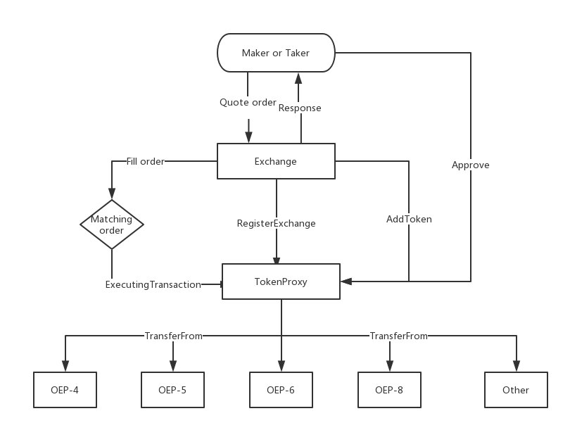

# TokenProxy Introduction

## 1. Overview 


OEP-35 is a standard cryto token exchange protocol for DDXF, it divides the exchange platform into two component`Exchange` and `TokenProxy`

**Exchange** is responsible for combining Maker's and Taker's orders, and sending orders to TokenProxy smart contrat.

**TokenProxy** is designed to decouple orders matching and token settlement on the blockchain, the token include ONT,ONG and other OEPs Token(like OEP-4,OEP-5,OEP-8)

## 2. Arichitecture



## 3. Exchange

### 3.1 Order Message Format

| Field            | Type    | Description                                  |
| ---------------- | ------- | -------------------------------------------- |
| version          | int     | order version                                |
| makerAddress     | address | maker wallet address                         |
| makerAssetAmount | int     | Amount of makerAsset being offered by maker. |
| makerTokenHash   | bytes   | the token hash of offered by maker           |
| takerAddress     | address | taker wallet address                         |
| takerAssetAmount | int     | Amount of takerAsset being bid on by maker.  |
| takerTokenHash   | bytes   | the token hash of offered by maker           |
| makerFee         | int     | Amount of fee paid to feeReceiver by maker   |
| takerFee         | int     | Amount of fee paid to feeReceiver by taker   |
| feeTokenHash     | bytes   | Exchange-charged token hash                  |
| feeReceiver      | int     | exchange fee receiver                        |
| expireTime       | int     | order expire time                            |

## 4. TokenProxy Interface

### 4.1 Method

#### 4.1.1 AddToken

```python
def AddToken(symbol:string, contractHash:bytearray)
```

- `symbol` is token symbol, like "ONT", "ONG"
- `contractHash` token script hash,such as ONT,ONG or other token hash, if success, this token can be exchanged on the exchange.

**Invoked only by smart contract admin**

#### 4.1.2 RemoveToken

```python
def RemoveToken(symbol:string, contractHash:bytearray)
```

- `symbol` is token symbol, like "ONT", "ONG"
- `contractHash`  This token will be removed from the exchange. 

**Invoked only by smart contract admin**

#### 4.1.3 GetTokens

```python
def GetTokens()
```
- Get all the tokens that can be traded in the exchange, it will response json data .

```python
{
	"ONT":"0000000000000000000000000000000000000001",
        "ONG":"0000000000000000000000000000000000000002"
}
```
#### 4.1.4 RegisterExchange

```python
def RegisterExchange(exchangeName:string, exchangeId:bytearray)
```
- `exchangeName` is exchange name, like "Huobi"
- `exchangeId` is exchange Id, essentially it is also a wallet address, only this exchange account can invoke token proxy smart contract

#### 4.1.5 RemoveExchange

```python
def RemoveExchange(exchangeId:bytearray)
```
- `exchangeName` is exchange name, like "Huobi"
- `exchangeId` is exchange Id，if success, the exchange can't invoke token proxy smart contract.

**Invoked only by smart  contract admin**

#### 4.1.6 GetAuthorizedExchange

```python
def GetAuthorizedExchange()
```
- Get all the exchange list that can invoke token proxy smart contract, it will response json data.

```python

  {
  "Huobi":"4cf4354d2d0ed34cbb80d09b364f0b5aeb14770a"
  }
  
```

#### 4.1.7 TokenTransferFrom

```python
def TokenTransferFrom(exchangeId:bytearray, order:Order)
```
-  `exchangerId`exchange id, **Invoked only by registered exchange**
-  `order` follow the order message format standards defined in above document.

This function will finish token settlement on blockchain according the order message.

**Note:** User need to approve the tokens to token proxy smart contract in advance.


#### 4.1.8 TokenTransferFromMulti

```python
def TokenTransferFromMulti(transferList:bytearray)
```
`transferList` is` TokenTransferFrom` function parameter array  list，

**Invoked only by registered exchange**


### 4.2 Event

#### 4.2.1. AddToken

```python
AddToken(contractHash:bytearray)
```

#### 4.2.2. RemoveToken

```python
RemoveToken(contractHash:bytearray)
```

#### 4.2.3. RegisterExchange

```python
RegisterExchange(exchangeId:bytearray)
```

#### 4.2.4. RemoveExchange

```python
RemoveExchange(exchangeId:bytearray)
```

#### 4.2.5. TokenTransferFrom

```python
TokenTransferFrom(order:Order)
```
